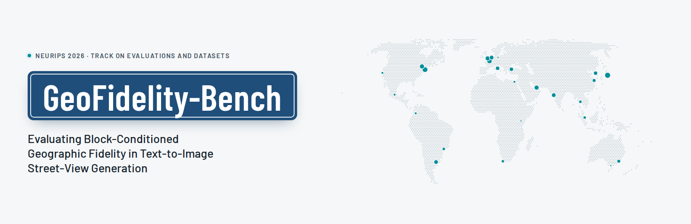
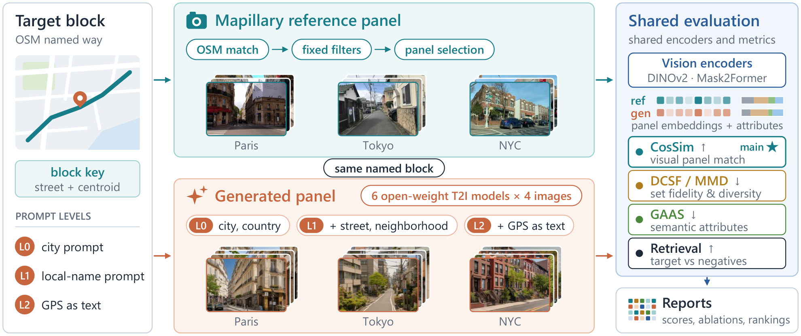
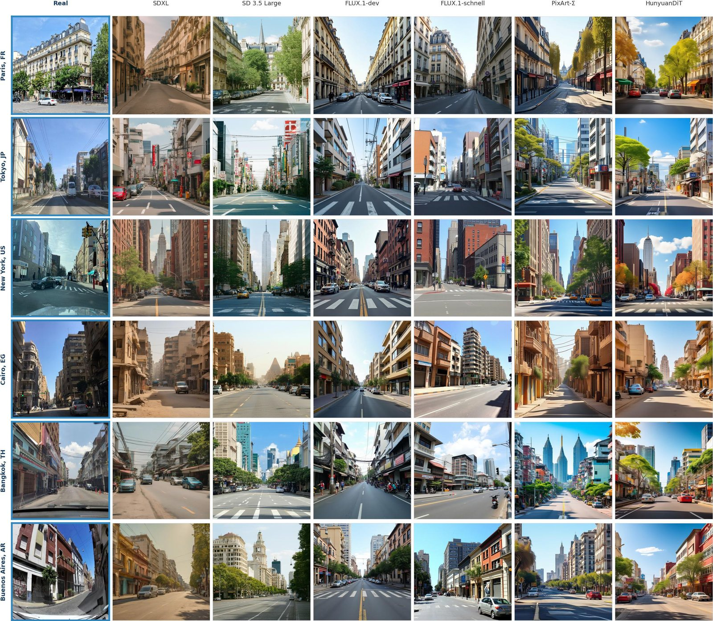

<p align="center">
  <picture>
    <source media="(prefers-color-scheme: dark)" srcset="docs/static/images/banner-dark.png">
    
  </picture>
</p>

<p align="center">
  <b>Kaizhen Tan</b><sup>1,2,3</sup><br>
  <sup>1</sup>Heinz College of Information Systems and Public Policy, Carnegie Mellon University<br>
  <sup>2</sup>Robert F. Wagner Graduate School of Public Service, New York University<br>
  <sup>3</sup>Shanghai Key Laboratory of Urban Design and Urban Science, NYU Shanghai
</p>

<p align="center">
  <a href="https://tantansir.github.io/geofidelity-bench-release/"></a>
  
  <a href="https://huggingface.co/datasets/moss-vector-714/GeoFidelity-Bench"></a>
  <a href="croissant.json"></a>
  <a href="LICENSE"></a>
</p>

GeoFidelity-Bench tests whether a text-to-image model draws the street block it was asked for, or only a generic view of the city. Each of its **112 named street blocks in 25 cities** comes with a panel of real Mapillary images, and generated images are compared with that panel and with the panels of other blocks in the same city.

## News

- **2026-09** · Camera-ready release for the NeurIPS 2026 Track on Evaluations and Datasets: de-anonymized repository, updated documentation, and a [project page](https://tantansir.github.io/geofidelity-bench-release/).

## Overview

<p align="center">
  
</p>

Each target is a named OpenStreetMap street block. Its geometry selects the Mapillary images that form the reference panel, and its metadata fills three prompt levels:

| Level | Information | Prompt fragment |
|:--|:--|:--|
| L0 | city + country | *taken in {city}, {country}* |
| L1 | L0 + street + neighborhood | *taken on {street} in the {neighborhood} district of {city}, {country}* |
| L2 | L1 + raw GPS as text | *... of {city}, {country}, near GPS coordinates ({lat}, {lon})* |

All levels share the same photorealistic, daytime, clear-weather suffix. Three same-city controls keep the L1 template and replace the street name, the neighborhood label, or both with those of another benchmark block. Six open-weight generators produce four images per block and prompt condition.

## Key findings

- **Local names help.** Street and neighborhood names raise CosSim to the target panel for all six generators: +0.036 (95% CI 0.029 to 0.042) over 672 matched (model, block) pairs, with 21 of 25 cities improving.
- **Coordinates as text add little.** Appending raw GPS coordinates changes CosSim by +0.004 (95% CI 0.001 to 0.008), and only 14 of 25 cities improve.
- **The right names matter.** Control prompts with another block's names lower retrieval accuracy, most when both names are replaced (−0.054).
- **Generated images often miss the block.** Under L1 prompts, generated images rank their target block first in 40% of cases; held-out real images of the same block do so in 86%.
- **CLIP alignment is no proxy.** CLIP similarity with the generation prompt predicts whether all four images retrieve the target at chance level (AUROC 0.508).

## Benchmark at a glance

| Statistic | Value | Notes |
|:--|--:|:--|
| Cities | 25 | 23 countries, six continents |
| Named street blocks | 112 | OSM ways, four road strata |
| Reference assignments | 7,563 | 7,433 distinct Mapillary images |
| Average images per block | 67.5 | minimum 25 per block |
| Prompt levels | 3 | plus three same-city controls |
| Generator models | 6 | open-weight text-to-image models |
| Retrieval entries per block | up to 5 | target, two same-city blocks, one same-driving-side city, one random city |

## Results

**CosSim by prompt level** (higher is better; paper Table 5)

| Model | L0 | L1 | L2 |
|:--|--:|--:|--:|
| SDXL | 0.512 | 0.536 | 0.536 |
| SD 3.5 Large | 0.432 | 0.515 | 0.516 |
| FLUX.1-dev | 0.456 | 0.484 | 0.496 |
| FLUX.1-schnell | 0.465 | 0.499 | 0.507 |
| PixArt-Σ | 0.459 | 0.486 | 0.489 |
| HunyuanDiT | 0.458 | 0.477 | 0.478 |

**L1 leaderboard with real-image anchors** (paper Table 10). CosSim and retrieval are higher-is-better; DCSF, MMD, and GAAS are lower-is-better.

| Model | CosSim ↑ | DCSF ↓ | MMD ↓ | GAAS ↓ | Retrieval ↑ |
|:--|--:|--:|--:|--:|--:|
| SDXL | **0.536** | **0.547** | **0.457** | **0.380** | 0.408 |
| SD 3.5 Large | 0.515 | 0.565 | 0.470 | 0.387 | 0.375 |
| FLUX.1-schnell | 0.499 | 0.571 | 0.481 | 0.395 | 0.382 |
| PixArt-Σ | 0.486 | 0.625 | 0.522 | 0.401 | **0.422** |
| FLUX.1-dev | 0.484 | 0.634 | 0.527 | 0.402 | 0.388 |
| HunyuanDiT | 0.477 | 0.637 | 0.531 | 0.421 | 0.420 |
| *Six-model mean* | 0.499 | 0.596 | 0.498 | 0.398 | 0.399 |
| *Held-out Real* | 0.902 | 0.036 | 0.020 | 0.285 | 0.855 |
| *Random-Same-Country* | 0.710 | 0.160 | 0.151 | 0.365 | 0.259 |
| *Random-Global* | 0.333 | 0.249 | 0.249 | 0.370 | 0.163 |

Random real images from the same country reach a higher CosSim than every generator but retrieve the target only 25.9% of the time, so CosSim and retrieval measure different properties. The project page has interactive versions of these tables, the prompt-control and CLIP analyses, the qualitative gallery, and the cross-city similarity matrix.

<details>
<summary><b>Qualitative comparison under city-only (L0) prompts</b> (paper Figure 2)</summary>
<br>

</details>

## Metrics

All images are embedded with DINOv2 ViT-B/14. Let $\mathcal{X}_g$ be the generated images for a block and $\mathcal{X}_r$ its reference panel.

| Metric | Better | Question | Failure it exposes |
|:--|:--:|:--|:--|
| CosSim (primary) | ↑ | Does the generated panel look like the target panel? | wrong local appearance |
| MMD | ↓ | How far apart are the two embedding distributions? | distribution drift |
| DCSF | ↓ | Does the set match the panel without losing diversity? | mode collapse or drift |
| GAAS | ↓ | Does the road, sky, and building mix agree (Mask2Former, Mapillary Vistas)? | wrong semantic composition |
| Retrieval | ↑ | Is the target panel ranked first among up to five candidate panels? | confusion with hard negatives |

Implementations: [`metrics/set_fidelity.py`](metrics/set_fidelity.py) (MMD, DCSF), [`metrics/geo_attribute.py`](metrics/geo_attribute.py) (GAAS), and [`eval/run_eval_v3.py`](eval/run_eval_v3.py) (CosSim, retrieval, mean reciprocal rank, per-candidate similarities).

## Installation

The code needs Python 3.10 or newer. Generation and evaluation run on CUDA by default (`DEVICE` in [`config.py`](config.py)).

```bash
git clone https://github.com/tantansir/geofidelity-bench-release.git
cd geofidelity-bench-release
python -m venv .venv
source .venv/bin/activate          # Windows PowerShell: .\.venv\Scripts\Activate.ps1
pip install -r requirements.txt
```

## Data

The dataset (version 3.1.0) is on Hugging Face: [moss-vector-714/GeoFidelity-Bench](https://huggingface.co/datasets/moss-vector-714/GeoFidelity-Bench). Download it into the repository root so that the relative image paths in `benchmark_v3.json` resolve:

```python
from huggingface_hub import snapshot_download

snapshot_download(
    "moss-vector-714/GeoFidelity-Bench",
    repo_type="dataset",
    local_dir=".",
    ignore_patterns=["README.md", ".gitattributes"],  # keep this repository's README
    # Metadata and released scores only:
    # allow_patterns=["metadata/*", "results/*", "data/processed/v3/*"],
)
```

Main entry points, as listed in [`croissant.json`](croissant.json):

| Path | Contents |
|:--|:--|
| `metadata/blocks.csv` | one row per block: `block_id` (city, road stratum, OSM way id, street), street and neighborhood names, centroid |
| `metadata/reference_images.csv` | reference assignments with a unique `reference_id`, the Mapillary `image_id`, paths, and GPS |
| `metadata/generated_images.csv` | every generated image with model, block, prompt level, path, seed, and prompt text |
| `metadata/prompt_controls.csv` | donor names used by the same-city controls |
| `data/processed/v3/benchmark_v3.json` | primary manifest: blocks, reference images, and retrieval negatives |
| `data/processed/v3/tier5_quality.csv` | final curation table with filter outputs and semantic pixel ratios |
| `data/raw/mapillary_v3/` | Mapillary reference images |
| `generations_v3/<model>/<level>/<block_id>/` | four generated images per block and prompt condition |
| `results/`, `outputs/eval_v3/` | released per-block and aggregate scores |

## Evaluate

Score one released generator at the three prompt levels. Pass a fresh `--out_dir` so that the released files in `outputs/eval_v3/` stay intact.

```bash
python eval/run_eval_v3.py --methods sdxl_base --levels L0 L1 L2 --out_dir outputs/eval_sdxl
```

Real-image anchors use the method names `oracle_nn` (Held-out Real), `random_same_country`, and `random_global`:

```bash
python eval/run_eval_v3.py --methods oracle_nn random_same_country random_global \
    --levels L1 --out_dir outputs/eval_anchors
```

Prompt-specificity controls are scored together with L1 and then paired by model and block:

```bash
python eval/run_eval_v3.py --methods sdxl_base \
    --levels L1 C_WRONG_STREET C_SHUFFLED_NEIGHBORHOOD C_WRONG_STREET_NEIGHBORHOOD \
    --out_dir outputs/eval_controls
python eval/control_ablation_v3.py \
    --raw_results outputs/eval_controls/raw_results.csv \
    --out_dir outputs/eval_controls/control_ablation
```

Each run writes per-block rows to `raw_results.csv` and means to `summary_by_method_level.csv`, `summary_by_method.csv`, `summary_by_level.csv`, and `summary_by_city.csv`.

### Evaluate your own model

1. For every block in `benchmark_v3.json` and every prompt level you want to test, write four images to `generations_v3/<your_model>/<level>/<block_id>/00.jpg ... 03.jpg`. The prompt for each (block, level) pair is in `metadata/generated_images.csv`; the templates are `V3_PROMPT_TEMPLATES` in [`config.py`](config.py).
2. Run `python eval/run_eval_v3.py --methods <your_model> --levels L0 L1 L2 --out_dir outputs/eval_<your_model>`.

Models that take coordinates, maps, satellite images, or retrieved photos as input can be scored the same way: the reference panels and retrieval galleries do not depend on how the images were produced.

## Reproduce the pipeline

### 1. Curate the reference panels

Requires a Mapillary access token and access to the Overpass API.

```bash
export MAPILLARY_TOKEN=<your-token>
python data/carve_blocks.py                   # named OSM ways -> data/processed/v3/blocks_v3.json
python data/run_curation_v3.py download       # Mapillary candidates along each block
python data/run_curation_v3.py tier3          # SigLIP urban-scene filter
python data/run_curation_v3.py tier4          # Mask2Former (Mapillary Vistas) segmentation
python data/relax_tier4_v3.py                 # apply the block-level segmentation gates
python data/run_curation_v3.py tier5          # blur, luminance, colorfulness, aspect ratio
python data/run_curation_v3.py curate         # -> data/processed/v3/benchmark_v3.json
```

`filter_tier4_segmentation.py` applies the stricter `TIER4_RATIOS` from the earlier place-level version. `relax_tier4_v3.py` re-applies `V3_TIER4_RATIOS`, which are the thresholds reported in Appendix A of the paper; run it before tier 5, because tier 5 only measures images that passed the earlier tiers. `run_curation_v3.py all` does not include this step.

### 2. Generate images

Model weights are loaded with `local_files_only=True`, so download them into the Hugging Face cache first. SD 3.5 Large and FLUX.1-dev are gated; accept their licenses on Hugging Face before downloading.

```bash
python -c "from huggingface_hub import snapshot_download; snapshot_download('stabilityai/stable-diffusion-xl-base-1.0')"

python data/build_prompt_controls_v3.py       # same-city control assignments
python generation/run_generation_v3.py --model sdxl_base --levels L0 L1 L2 --resume
python generation/run_generation_v3.py --model sdxl_base --resume \
    --levels C_WRONG_STREET C_SHUFFLED_NEIGHBORHOOD C_WRONG_STREET_NEIGHBORHOOD
```

Images are generated at 1024 × 1024 with per-image seeds derived from (model, block, level, index) and saved as 512 × 512 JPEGs. The released L0 images reuse a pool of city-only generations for each city ([`generation/seed_v3_L0_from_v2.py`](generation/seed_v3_L0_from_v2.py)); the command above generates new L0 images with the same template instead.

| `--model` | Weights | Steps | Guidance | Precision | CPU offload |
|:--|:--|--:|--:|:--:|:--:|
| `sdxl_base` | `stabilityai/stable-diffusion-xl-base-1.0` | 30 | 5.0 | fp16 | no |
| `sd35_large` | `stabilityai/stable-diffusion-3.5-large` | 28 | 3.5 | bf16 | yes |
| `flux_dev` | `black-forest-labs/FLUX.1-dev` | 28 | 3.5 | bf16 | yes |
| `flux_schnell` | `black-forest-labs/FLUX.1-schnell` | 4 | 0.0 | bf16 | yes |
| `pixart_sigma` | `PixArt-alpha/PixArt-Sigma-XL-2-1024-MS` | 20 | 4.5 | fp16 | no |
| `hunyuan_dit` | `Tencent-Hunyuan/HunyuanDiT-Diffusers` | 50 | 5.0 | fp16 | no |

### 3. Evaluate and analyze

```bash
python eval/run_eval_v3.py --levels L0 L1 L2  # six generators and three anchors -> outputs/eval_v3/
python eval/reviewer_analysis_v3.py           # paired bootstrap and city-balanced deltas, hierarchy gaps,
                                              # city-bootstrap ranking stability -> outputs/eval_v3/reviewer_stats/
```

## Repository structure

```text
config.py                        paths, curation thresholds, city list, prompt templates
data/
  carve_blocks.py                named OSM ways -> blocks_v3.json
  download_mapillary_v3.py       block-level Mapillary download
  filter_tier3_siglip.py         SigLIP urban-scene filter
  filter_tier4_segmentation.py   Mask2Former semantic ratios
  relax_tier4_v3.py              block-level segmentation gates
  filter_tier5_quality.py        low-level image quality
  curate_blocks_v3.py            final benchmark_v3.json
  run_curation_v3.py             runs the stages above
  build_prompt_controls_v3.py    same-city control assignments
generation/
  registry.py, pipelines.py      the six Diffusers generators
  run_generation_v3.py           block-level generation (L0-L2 and controls)
  seed_v3_L0_from_v2.py          reuse of city-only generations as L0
metrics/                         MMD and DCSF, GAAS, panel retrieval
eval/
  run_eval_v3.py                 main evaluation
  control_ablation_v3.py         L1 versus control prompts
  reviewer_analysis_v3.py        uncertainty and stability analyses
  metric_human_correlation_v3.py pilot human-study analysis
scripts/build_paper_tables_v3.py LaTeX macros for the paper tables
docs/                            project page (GitHub Pages)
croissant.json                   Croissant metadata for the dataset
```

Scripts without the `_v3` suffix (for example `eval/run_eval.py`, `data/run_curation.py`, and `baselines/`) belong to an earlier place-level version of the benchmark and are kept for reference; the paper uses the v3 block-level pipeline.

## Project page

The page in [`docs/`](docs/) is a static site with no build step. To publish it, open *Settings → Pages* in this repository and deploy from the default branch with the `/docs` folder; it is then served at <https://tantansir.github.io/geofidelity-bench-release/>.

## Citation

```bibtex
@inproceedings{tan2026geofidelitybench,
  title     = {{GeoFidelity-Bench}: Evaluating Block-Conditioned Geographic Fidelity
               in Text-to-Image Street-View Generation},
  author    = {Tan, Kaizhen},
  booktitle = {Advances in Neural Information Processing Systems (NeurIPS),
               Track on Evaluations and Datasets},
  year      = {2026}
}
```

GitHub also reads [`CITATION.cff`](CITATION.cff) for the "Cite this repository" button.

## License

- Code in this repository: [MIT License](LICENSE).
- Reference images: Mapillary, [CC BY-SA 4.0](https://creativecommons.org/licenses/by-sa/4.0/).
- Block metadata derived from OpenStreetMap: [ODbL 1.0](https://opendatacommons.org/licenses/odbl/), © OpenStreetMap contributors.
- Generated images: the terms of each source model, listed in the dataset card.

The benchmark is intended for evaluating geographic fidelity. It is not intended for surveillance, person identification, or any use that could harm people depicted in Mapillary imagery.

## Acknowledgments

Street-level imagery comes from Mapillary contributors and map data from OpenStreetMap contributors. The author funded this research personally and received no external funding for this work.

Contact: Kaizhen Tan, kt3275@nyu.edu
